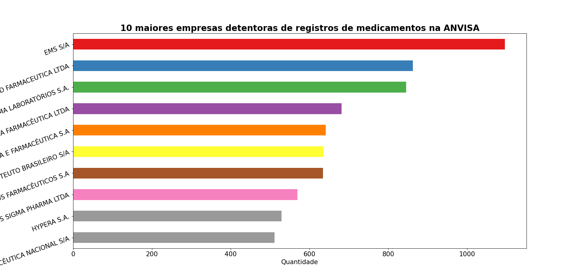

# Análise de dados sobre os registros de medicamentos na ANVISA

## Sumário
- [Introdução](https://github.com/fernandessfae/produtos_registrados_medicamentos#introdu%C3%A7%C3%A3o)
- [Análise Geral](https://github.com/fernandessfae/produtos_registrados_medicamentos#an%C3%A1lise-geral)
    - [Registro medicamentos](https://github.com/fernandessfae/produtos_registrados_medicamentos#registro-medicamentos)
    - [Categoria regulatória](https://github.com/fernandessfae/produtos_registrados_medicamentos#categoria-regulat%C3%B3ria)
    - [Classe terapêutica](https://github.com/fernandessfae/produtos_registrados_medicamentos#classe-terap%C3%AAutica)
    - [Princípio ativo](https://github.com/fernandessfae/produtos_registrados_medicamentos#princ%C3%ADpio-ativo)
    - [Empresas detentoras dos registros](https://github.com/fernandessfae/produtos_registrados_medicamentos#empresas-detentoras-dos-registros)
- [Resolução do problema](https://github.com/fernandessfae/produtos_registrados_medicamentos#resolu%C3%A7%C3%A3o-do-problema)
    - [Pré-processamento de dados](https://github.com/fernandessfae/produtos_registrados_medicamentos#pr%C3%A9-processamento-de-dados)
    - [Criação dos algoritmos de machine learning](https://github.com/fernandessfae/produtos_registrados_medicamentos#cria%C3%A7%C3%A3o-dos-algoritmos-de-machine-learning)
    - [Avaliação dos modelos de machine learning](https://github.com/fernandessfae/produtos_registrados_medicamentos#avalia%C3%A7%C3%A3o-dos-modelos-de-machine-learning)
        - [Acurácia](https://github.com/fernandessfae/produtos_registrados_medicamentos#acur%C3%A1cia)
        - [Matriz de confusão](https://github.com/fernandessfae/produtos_registrados_medicamentos#matriz-de-confus%C3%A3o)
        - [Precisão](https://github.com/fernandessfae/produtos_registrados_medicamentos#precis%C3%A3o)
        - [Recall](https://github.com/fernandessfae/produtos_registrados_medicamentos#recall)
        - [F1-Score](https://github.com/fernandessfae/produtos_registrados_medicamentos#f1-score)
    - [Deploy](https://github.com/fernandessfae/produtos_registrados_medicamentos#deploy)
- [Conclusão](https://github.com/fernandessfae/produtos_registrados_medicamentos#conclus%C3%A3o)

## Introdução

A criação de medicamentos não é algo relativamente novo na sociedade em geral, cujo objetivo é encontrar a cura de alguma doença ou tratamento para amenizar os efeitos da mesma. No Brasil, todo medicamento criado precisa ser registrado na agência de vigilância sanitária (ANVISA), orgão regulador na área da saúde, para depois receber autorização para comercialização, industrialização,venda e consumo, obviamente depois da análise da documentação que comprove a eficiência dele, conforme escrito no artigo 12 da lei 6.360/1976. A finalidade do registro é para garantir que um novo medicamento tenha impacto positivo na saúde da população brasileira. Para maiores informações sobre registro de medicamentos, basta acessar o site da ANVISA clicando <a href='http://antigo.anvisa.gov.br/resultado-de-busca?p_p_id=101&p_p_lifecycle=0&p_p_state=maximized&p_p_mode=view&p_p_col_id=column-1&p_p_col_count=1&_101_struts_action=%2Fasset_publisher%2Fview_content&_101_assetEntryId=5062720&_101_type=content&_101_groupId=219201&_101_urlTitle=registro-de-novos-medicamentos-saiba-o-que-e-preciso&inheritRedirect=true'>aqui</a>.

 

## Análise Geral

Após uma breve explicação sobre o registro de medicamentos na ANVISA, agora cabe explicar sobre os dados dos registros desses medicamentos. Esses dados estão disponíveis no site dos dados abertos do governo federal, clicando <a href='https://dados.gov.br/dados/conjuntos-dados/medicamentos-registrados-no-brasil'>aqui</a> basta ir na aba 'recursos' para encontrá-los. Caso o link esteja indisponível para acesso, deixarei disponível o acesso para <a href='https://github.com/fernandessfae/produtos_registrados_medicamentos/blob/master/DADOS_ABERTOS_MEDICAMENTOS.csv'>base de dados</a> e ao <a href='https://github.com/fernandessfae/produtos_registrados_medicamentos/blob/master/Documentacao_e_Dicionario_de_Dados_Registros_Validos_Medicamento_V1.pdf'>dicionário de dados</a>, estes que estarão presentes neste repositório.

Falando especificamente sobre os dados, são cerca de 30.725 registros de medicamentos até o momento, divididos em 11 colunas com informações específicas do medicamento em cada coluna. a partir daí  faremos algumas análises gerais sobre algumas colunas específicas. 

### Registro medicamentos

Veremos os 10 maiores registros de medicamentos pela ANVISA 
 

Fonte: Arquivo pessoal (2023)
 

Como podemos ver, a maioria dos remedios com maiores registros servem para combater bactérias (amoxicilina), vírus (aciclovir) ou até algum tipo de dor geral (paracetamol, ibuprofeno). Do total de 17.588 medicamentos registrados, o paracetamol, amoxicilina, aciclovir, cetoconazol e ibuprofeno representam 0,87%, 0,56%, 0,53%, 0,52% e 0,41%, respectivamente.  Algumas curiosidades interessantes sobre os medicamentos registrados chamaram a atenção. A primeira dela foi a <b>data de finalização do processo de registro</b>, sendo que a mais <b>antiga</b> foi o medicamento <b>ALANTOINA + ACIDO BORICO+OXIDO DE ZINCO</b>, cujo processo foi finalizado em <b>01/01/1901</b>, e a mais <b>recente</b> foi <b>CANEPHRON</b>, onde o processo de registro foi finalizado em <b>07/08/2023</b>.  Outra curiosidade é em relação a <b>data de vencimento do registro</b> do medicamento, que significa que a patente estará disponível para qualquer um que queira usar o medicamento. E o vencimento de registro de medicamento mais <b>antigo</b> é <b>OZONYL</b>, cujo vencimento foi <b>01/05/1973</b> e o mais <b>recente</b> é o <b>LAMOSYN CD</b> e o seu vencimento será em <b>01/09/2101</b>.

### Categoria regulatória

Aqui veremos quais as categorias os medicamentos se enquadram após a aprovação do registro na ANVISA:
 

Fonte: Arquivo pessoal (2023)
 

Nesse gráfico percebemos que a grande maioria dos medicamentos registrados na estão nas categorias <b>similar</b>, <b>genérico</b> ou <b>novo</b>.

### Classe terapêutica

Aqui veremos quais as classes terapêuticas os medicamentos se enquadram:
 

Fonte: Arquivo pessoal (2023)
 

Aqui percebemos que a grande parte dos medicamentos registrados estão nas classes <b>antibioticos sistêmicos simples</b>, <b>antinflamatórios</b> e <b>analgésicos não narcóticos</b>.

### Princípio ativo

Aqui veremos quais os principios ativos estão presentes nos medicamentos registrados na ANVISA:
 

Fonte: Arquivo pessoal (2023)
 

Aqui podemos constatar que boa parte dos medicamentos possuem <b>paracetamol</b> e <b>ibuprofeno</b> como principio ativo na sua composição.Chama a atenção o fato do paracetamol, onde os medicamentos são registrados com o nome do seu principio ativo, como visto no gráfico da seção <a href=''>Registro medicamentos</a>, diferentemente do ibuprofeno onde os mais diversos nome de medicamento possuem, em seu principio ativo, o nome do mesmo.

### Empresas detentoras dos registros

Aqui veremos quais os principios ativos estão presentes nos medicamentos registrados na ANVISA:
 

Fonte: Arquivo pessoal (2023)
 

Dentre as empresas com os maiores registros de medicamentos estão a <b> EMS S/A</b>, <b>GERMED FARMACEUTICA LTDA</b> e <b>EUROFARMA LABORATÓRIOS S.A</b>, com 1096, 862 e 845 registros, respectivamente.
 

Para informações mais detalhadas sobre como foi feito a análise dos dados e/ou geração dos gráficos, basta acessar o(s) arquivo(s) <a href=''>analise.ipynb</a> e/ou <a href=''>analise_graficos.py</a>.

## Resolução do problema

O processo de registro de medicamentos na ANVISA costuma ser diferente de acordo com o tipo de classe regulatória. Porém, quando um novo medicamento é criado, as vezes chega a ser um desafio pode classificar esse novo medicamento. É com esse problema que teremos como criar um algoritmo de machine learning para ajudar a resolver esse problema. <b>Machine Learning</b>, ou aprendizado de máquina, é um algoritmo  que ensina a máquina classificar um produto de acordo com outros parâmetros indicados. E é justamente com essa ferramenta que iremos utiliza-la para resolver esse problema.

### Pré-processamento de dados

O primeiro passo é identificar quais aspectos são relevantes para classificar o registro do medicamento. Nesse caso específico, a <b>classe terapêutica</b> e <b>principio ativo</b> são suficientes para determinar o tipo de registro do medicamento. Com base nisso, faremos uma alteração na base de dados principal, contando apenas com as colunas citadas anteriormente. Essa etapa é chamada de pré-processamento de dados, onde será feito vários processos (retirada/imputação de valores, criação de colunas através dos próprios dados, dentre outros) antes de enviar os dados a aplicar no algoritmo de machine learning. Nesse caso dos registros dos medicamentos, optou-se em remover todos as linhas da base de dados se a coluna 'categoria regulatória' estivesse com o campo vazio. Essa retirada diminuiu o tamanho da base de dados em 7%, um limite que julgo ser aceitável, já que a base de dados possui mais de 30.000 linhas. Após isso, as colunas 'classe terapêutica' e 'princípio ativo', que tinham as linhas das respectivas colunas com os valores vazios, foram preenchidas com o valor 'DESCONHECIDO'. O motivo deste valor foi que, com a maior variedade de classes terapêuticas e principios ativos, ficaria mais interessante para o próprio algoritmo tentar classificar um novo registro do medicamento na ANVISA. Após o pré-processamento iremos ver a quantidade de registros para o tipo de medicamento específico:
 

Fonte: Arquivo pessoal (2023)
 

Podemos ver que, como dito anteriormente, e remoção de registros não afetou a quantidade total de registros que poderiam ser utilizados para aprendizado de máquina, entretanto percebemos um certo desbalanceamento de cada classe das categorias, algo que pode influenciar na precisão do algoritmo. Existem técnicas para tentar balancear essas classes ou utilizar um algoritmo que tenha uma melhor performance com essas situação dos dados desbalanceados.

### Criação dos algoritmos de machine learning

O criação dos modelos é uma das etapas mais simples e complexas ao mesmo tempo. Simples porque é bem direto de como montar esses modelos, porém complexos porque, para um profissional mais experiente, o desafio é ajustar os parâmetros do(s) modelo(s) para que seja o mais performático possível e evitar possíveis interferências e vieses. Nesse caso, utilizou-se os parâmetros padrões de cada modelo de machine learning, com o intuito de verificar a precisão de cada modelo, sem nenhuma alteração. Abaixo estarão alguns algoritmos de machine learning escolhidos para fazer a classificação das categorias regulatórias dos novos remédios:
 

- Naive Bays 
- Decision Tree 
- KNN (K Nearest Neighbors) 
- SVM (Support Vector Machine) 
- Random Forest 

Existem outros modelos de algoritmos de machine learning, mas estes estão de bom tamanho para fazer a classificação dos registros dos novos medicamentos.

Para todos os modelos acima, os dados foram separados em treinamento e teste, também conhecido como <b>holdout</b>, para treinar os modelos citados anteriormente. Existem outras formas de seperação de dados, como a <b>validação cruzada</b> e a <b>validação cruzada estratificada</b>. Como existem uma grande quantidade de registros, creio que o <b>holdout</b> seja a escolha mais adequada. O modelo de treinamento de cada algoritmo foi criado de maneira separada, com o intuito de melhorar a organização. Após os modelos criados, vamos ver a precisão de cada um deles.
 

### Avaliação dos modelos de machine learning

Após a criação dos modelos, seja dividindo os dados para treinamento e teste ou fazendo uma validação cruzada, são necessárias métricas para avaliar o quão bom um modelo de classificação está, antes de disponibilizá-lo para o público. Nesse tópico será uma discussão um pouco mais técnica, então para quem não entende esse assunto, pode ler o próximo <a href='https://github.com/fernandessfae/produtos_registrados_medicamentos#deploy'>tópico</a>. Continuando, abaixo veremos algumas métricas de avaliação de modelo de machine learning:

#### Acurácia

Acurácia é a métrica mais simples de ser entendida. Isso porque ela representa o quanto de dados um modelo acertou em relação ao total de dados separado para teste. Abaixo veremos uma tabela com a acurácia dos modelos citados acima após o treinamento com os dados disponibilizados:
 

|Modelo|Acurácia (%)|
|:------:|:------:|
|Naive Bayes|51|
|Decision Tree|**60**|
|KNN|57|
|SVM|54|
|Random Forest|**60**|

 No quesito <b>acurácia</b>, os modelos baseados em árvores (decision tree e random forest) foram os que tiveram maiores acurácias em relação aos outros modelos. Porém, não pode ser o único parâmetro a ser avaliado para decidir qual modelo será utilizado para produção, vendo os demais critérios a seguir.
 

#### Matriz de confusão

A matriz de confusão é a representação daquilo que o modelo de machine learning previu comparado com o valor real de cada classe dos dados. É a representação da acurácia em forma de gráfico. Abaixo veremos um exemplo da matriz de confusão do modelo <b>decision tree</b>. As matrizes de confusão de outros modelos serão disponibilizados nesse repositório.

Fonte: Arquivo pessoal (2023)
 

#### Precisão

A precisão diz respeito à quantidade (proporcional) de identificações positivas feita corretamente. Nesse caso específico, ele informa a proporção de acerto que o modelo fez para cada classe. Os valores vão de 0 (acerto mínimo) até 1 (acerto máximo).
 

|Classe\Modelo|Naive Bayes|Decision Tree|KNN|SVM|Random Forest|
|:------:|:------:|:------:|:------:|:------:|:------:|
|Similar|0,55|0,62|0,60|0,58|**0,63**|
|Fitoterápico|0,14|**0,81**|0,76|0|0,80|
|Novo|0,25|**0,41**|0,32|0,36|**0,41**|
|Biológico|0,20|0,54|0,53|0|**0,57**|
|Específico|0|**0,84**|0,55|0|0,82|
|Genérico|0,35|**0,51**|0,48|0,45|**0,51**|
|Dinamizado|0|**0,95**|0,89|0|0,93|
|Radiofármaco|0|0,54|0,43|0|**0,60**|
|Produto de T|0|0|0|0|0|

 No critério <b>precisão</b>, os modelos baseado em árvore se sairam melhores comparado a outros.

#### Recall

O recall mostra a proporção de positivos encontrados corretamente. Nesse caso específico, ele informar o quanto o modelo conseguiu prever corretamente de cada classe. Os valores vão de 0 (acerto mínimo) até 1 (acerto máximo).
 

|Classe\Modelo|Naive Bayes|Decision Tree|KNN|SVM|Random Forest|
|:------:|:------:|:------:|:------:|:------:|:------:|
|Similar|**0,91**|0,80|0,75|0,81|0,79|
|Fitoterápico|0,04|0,75|0,71|0|**0,76**|
|Novo|0,13|0,12|**0,17**|0,08|0,14|
|Biológico|0,13|0,52|0,39|0|**0,53**|
|Específico|0|0,45|**0,49**|0|0,48|
|Genérico|0,08|0,41|0,38|**0,46**|0,44|
|Dinamizado|0|**0,93**|0,89|0|**0,93**|
|Radiofármaco|0|**0,70**|0,30|0|0,60|
|Produto de T|0|0|0|0|0|

 Utilizando essa métrica, percebe-se que o <b>random forest</b> saiu ligeiramente melhor do que a <b>decision tree</b>.

#### F1-Score

O F1-Score é a média harmônica entre precisão e recall. O melhor valor possível para o F1-score é 1 e o pior é 0.
 

|Classe\Modelo|Naive Bayes|Decision Tree|KNN|SVM|Random Forest|
|:------:|:------:|:------:|:------:|:------:|:------:|
|Similar|0,68|**0,70**|0,67|0,67|**0,70**|
|Fitoterápico|0,07|**0,78**|0,74|0|**0,78**|
|Novo|0,17|0,19|**0,22**|0,14|0,21|
|Biológico|0,16|0,53|0,45|0|**0,55**|
|Específico|0|0,59|0,52|0|**0,60**|
|Genérico|0,13|0,45|0,43|0,45|**0,47**|
|Dinamizado|0|**0,94**|0,89|0|0,93|
|Radiofármaco|0|**0,61**|0,35|0|0,60|
|Produto de T|0|0|0|0|0|

 Avaliando todas as métricas, percebe-se que os modelos <b>tree decision</b> e <b>random forest</b> foram os que tiveram melhor performance para a classificação de novos remédios. Então a escolha se dará por outro critério. Como o modelo <b>random forest</b> utilizam várias <b>trees decision</b>, então é melhor utilizar o modelo <b>tree decision</b> para diminiuir o custo computacional de processamento. Após escolhido o algoritmo, será gerado um arquivo com o mesmo treinado para ser colocado para produção.

### Deploy

Depois das etapas de pré-processamento, criação e comparação de algoritmos de machine learning, agora é a hora de colocar o modelo em funcionamento para outras pessoas poderem utilizar. Para isso, será utilizado o Streamlit, que é um hospedador gratuito de sites, cujo intuito é fazer com que o algoritmo seja testado por outras pessoas. Para isso funcionar, foi feito o pre-processamento dos dados de entrada no Streamlite até a parte de subida de produção do modelo de machine learning, cujo link para acesso pode ser acessado por <a href='https://apputosregistradosmedicamentos-uhxnb7futuvzqva4sqk8nq.streamlit.app/'>aqui</a>.

## Conclusão

A conclusão desse projeto mostra o quão necessário e importante é a criação de soluções orientado a dados. Desde uma simple análise até a criação de modelos de classificação de registro de medicamentos na ANVISA, tudo isso ajuda, de alguma forma, a resolver o problema. Percebe-se que uma solução orientada a dados requer muitas etapas, desde o pre-processamento até o lançamento do algoritmo para o público em geral. Dito isso, podemos perceber que, onde tem dados, provavelmente terá alguma solução para ser feita, independentemente da área de atuação.
